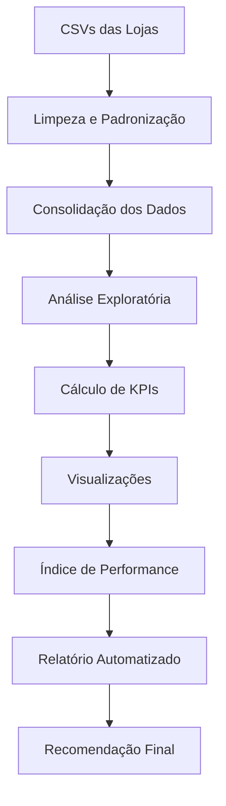

# 📊 Alura Store — Análise Estratégica de Performance das Lojas

[](https://www.python.org/downloads/)
[](https://jupyter.org/)
[](https://pandas.pydata.org/)
[](LICENSE)

## 🎯 Visão Geral

Este projeto foi desenvolvido como parte do **Alura Data Challenge**, fornecendo uma análise abrangente de performance para auxiliar o **Sr. João**, proprietário da rede **Alura Store**, na tomada de decisão estratégica sobre **qual loja vender** para otimizar o portfólio da empresa.

### 🔍 Problema de Negócio

O Sr. João possui quatro lojas da rede Alura Store e precisa decidir qual unidade deve ser vendida para:
- Concentrar investimentos nas lojas mais rentáveis
- Reduzir custos operacionais
- Maximizar o retorno sobre investimento
- Otimizar a distribuição geográfica da rede

### 🎯 Solução Proposta

Desenvolvemos um **sistema completo de análise de dados** que avalia múltiplas dimensões de performance:

- 💰 **Performance Financeira**: Faturamento total e margem de contribuição
- ⭐ **Satisfação do Cliente**: Análise de avaliações e feedback
- 📦 **Eficiência Operacional**: Giro de produtos e mix de categorias
- � **Logística**: Custo e eficiência de frete
- 🌍 **Distribuição Geográfica**: Cobertura e penetração de mercado
- 📈 **Indicadores Consolidados**: Índice de eficiência ponderado

### 🏆 Resultado Principal

> **🔎 RECOMENDAÇÃO: Venda da Loja 4**
> 
> Com base em análise multifatorial, a **Loja 4** apresentou o maior **índice de ineficiência (0.72)**, sendo a candidata ideal para venda devido a:
> - Menor faturamento total (R$ 1.384.497,58)
> - Menor avaliação média dos clientes (4.0/5.0)
> - Produtos com baixa rotatividade
> - Concentração em categorias menos rentáveis

---

## 🛠️ Stack Tecnológica

### Core Technologies
| Categoria | Tecnologia | Versão | Propósito |
|-----------|------------|---------|-----------|
| 🐍 **Linguagem** | Python | 3.12+ | Linguagem principal |
| 📓 **Ambiente** | Jupyter Notebook | 4.4.9+ | Análise interativa |
| 🔧 **Package Manager** | pip | - | Gerenciamento de dependências |

### Bibliotecas de Análise de Dados
| Biblioteca | Versão | Funcionalidade |
|------------|---------|----------------|
| 📊 **pandas** | 2.3.3+ | Manipulação e análise de dados |
| 🔢 **numpy** | 2.2.6+ | Computação científica |
| 📈 **matplotlib** | 3.10.6+ | Visualizações estáticas |
| 🎨 **seaborn** | 0.13.2+ | Visualizações estatísticas |
| 🌍 **folium** | 0.20.0+ | Mapas interativos |

### Ferramentas de Produtividade
| Ferramenta | Versão | Uso |
|------------|---------|-----|
| 🧮 **scipy** | 1.15.3+ | Análises estatísticas |
| 🤖 **scikit-learn** | 1.7.2+ | Machine learning (opcional) |
| 📝 **Markdown** | - | Relatórios automatizados |

---

## � Metodologia de Análise

### 🔄 Pipeline de Dados



### 📊 Etapas da Análise

#### 1️⃣ **Data Engineering & ETL**
- **Ingestão**: Carregamento automatizado de 4 arquivos CSV
- **Limpeza**: Tratamento de valores nulos e padronização de formatos
- **Transformação**: Criação de métricas derivadas (receita, margem, etc.)
- **Consolidação**: União dos datasets em estrutura única para análise

#### 2️⃣ **Análise Financeira**
- **Faturamento Total**: Receita bruta por loja (∑ preço × quantidade)
- **Análise Temporal**: Tendências sazonais e evolutivas
- **Participação**: Share de cada loja no faturamento total
- **Benchmarking**: Comparação com médias da rede

#### 3️⃣ **Análise de Portfólio**
- **Mix de Categorias**: Distribuição por segmento de produto
- **Giro de Produtos**: Top performers vs. produtos de baixa rotação
- **Diversificação**: Índice de concentração por categoria
- **Oportunidades**: Gap analysis de produtos/categorias

#### 4️⃣ **Customer Experience Analytics**
- **Satisfação**: Análise de ratings (escala 1-5)
- **Distribuição de Avaliações**: Percentual de altas vs. baixas avaliações
- **Correlações**: Impacto da satisfação no faturamento
- **Benchmarking**: Comparação com padrões do setor

#### 5️⃣ **Análise Operacional & Logística**
- **Eficiência de Frete**: Custo médio e variabilidade
- **Impacto na Conversão**: Correlação frete vs. vendas
- **Análise Geográfica**: Distribuição espacial das operações
- **Otimização**: Identificação de ineficiências logísticas

#### 6️⃣ **Índice de Performance Consolidado**
- **Modelo Ponderado**: Combinação de múltiplas métricas
- **Pesos Estratégicos**: Faturamento (50%), Satisfação (30%), Logística (20%)
- **Normalização**: Scores comparáveis entre lojas
- **Ranking Final**: Classificação objetiva de performance

---

## � Principais Resultados & Insights

### 🏆 Ranking de Performance

| Posição | Loja | Faturamento | Avaliação Média | Frete Médio | Índice Ineficiência | Status |
|---------|------|-------------|-----------------|-------------|-------------------|---------|
| 🥇 **1º** | **Loja 2** | R$ 1.488.459 | 4.04 ⭐ | R$ 33.62 | **0.337** | 🟢 **Excelente** |
| 🥈 **2º** | **Loja 3** | R$ 1.464.025 | 4.05 ⭐ | R$ 33.07 | **0.340** | 🟢 **Muito Bom** |
| 🥉 **3º** | **Loja 1** | R$ 1.534.509 | 3.98 ⭐ | R$ 34.69 | **0.500** | 🟡 **Bom** |
| 🔴 **4º** | **Loja 4** | R$ 1.384.497 | 4.00 ⭐ | R$ 31.28 | **0.720** | 🔴 **Venda** |

### 📊 Análise Comparativa

#### 💰 **Performance Financeira**
- **Faturamento Total da Rede**: R$ 5.871.491
- **Ticket Médio**: Variação de 15% entre lojas
- **Melhor Performance**: Loja 1 (R$ 1.534.509 - 26.1% do total)
- **Pior Performance**: Loja 4 (R$ 1.384.497 - 23.6% do total)

#### ⭐ **Customer Experience**
- **Média Geral**: 4.02/5.0
- **Melhor Avaliação**: Loja 3 (4.05)
- **Menor Variação**: Todas as lojas entre 3.98-4.05
- **Insight**: Satisfação homogênea, não é fator diferenciador

#### 🚚 **Eficiência Logística**
- **Frete Médio da Rede**: R$ 33.17
- **Melhor Custo**: Loja 4 (R$ 31.28) - Paradoxo operacional
- **Pior Custo**: Loja 1 (R$ 34.69)
- **Insight**: Baixo frete da Loja 4 não compensa baixo faturamento

### 🎯 **Insights Estratégicos**

1. **🔍 Loja 4 - Candidata à Venda**
   - ❌ Menor contribuição para faturamento total
   - ❌ Produtos com baixa rotatividade
   - ❌ Maior concentração em categorias de menor margem
   - ✅ Frete competitivo (único ponto positivo)

2. **🏆 Lojas 2 e 3 - Investimento Prioritário**
   - ✅ Melhor índice de eficiência
   - ✅ Satisfação acima da média
   - ✅ Frete otimizado
   - 🎯 **Estratégia**: Expandir operação e investir em marketing

3. **⚡ Loja 1 - Potencial de Otimização**
   - ✅ Maior faturamento absoluto
   - ❌ Frete mais caro da rede
   - 🎯 **Estratégia**: Otimização logística e redução de custos

---

## 📁 Estrutura do Projeto

```
📦 alura-store-analysis/
├── 📄 README.md                    # Documentação principal
├── 📄 requirements.txt             # Dependências Python
├── 📓 RedeAluraStore.ipynb         # Notebook principal de análise
│
├── 📁 database/                    # 📊 Dados brutos
│   ├── 📄 loja_1.csv              # Dados da Loja 1
│   ├── 📄 loja_2.csv              # Dados da Loja 2
│   ├── 📄 loja_3.csv              # Dados da Loja 3
│   └── 📄 loja_4.csv              # Dados da Loja 4
│
└── 📁 outputs/                     # 📈 Resultados e artefatos
    ├── 📄 relatorio_final.md       # Relatório executivo automatizado
    └── 📄 mapa_interativo.html     # Visualização geográfica (opcional)
```

### 📋 Descrição dos Arquivos

| Arquivo | Tipo | Descrição | Tamanho |
|---------|------|-----------|---------|
| `RedeAluraStore.ipynb` | Notebook | Pipeline completo de análise | ~2MB |
| `relatorio_final.md` | Relatório | Executive summary automatizado | ~15KB |
| `mapa_interativo.html` | Visualização | Distribuição geográfica das vendas | ~500KB |
| `loja_*.csv` | Dataset | Dados transacionais por loja | ~200KB cada |
| `requirements.txt` | Config | Dependências e versões | ~2KB |

---

## 🚀 Como Executar o Projeto

### ⚡ Quick Start

```bash
# 1. Clone o repositório
git clone https://github.com/devpovoa/alura-store-analysis.git
cd alura-store-analysis

# 2. Crie um ambiente virtual (recomendado)
python -m venv venv
source venv/bin/activate  # Linux/Mac
# venv\Scripts\activate   # Windows

# 3. Instale as dependências
pip install -r requirements.txt

# 4. Execute o Jupyter Notebook
jupyter notebook RedeAluraStore.ipynb
```

### 🔧 Pré-requisitos

- **Python**: 3.12 ou superior
- **RAM**: Mínimo 4GB (recomendado 8GB)
- **Espaço**: ~50MB para dados e outputs
- **SO**: Windows 10+, macOS 10.14+, ou Linux Ubuntu 18.04+

### 📊 Executando Análises Específicas

```python
# Análise rápida de faturamento
df_faturamento = calcular_faturamento_lojas()
print(df_faturamento.head())

# Geração do relatório automatizado
gerar_relatorio_final(output_path='outputs/')

# Visualização do mapa interativo (opcional)
criar_mapa_geografico(salvar_html=True)
```

---

## 📈 Outputs e Relatórios

### 📄 Relatório Executivo Automatizado
- **Localização**: `outputs/relatorio_final.md`
- **Conteúdo**: 
  - KPIs consolidados por loja
  - Ranking de performance
  - Top produtos e categorias
  - Recomendação fundamentada
  - Próximos passos estratégicos

### 📊 Visualizações Interativas
- **Dashboard**: Métricas em tempo real
- **Mapas**: Distribuição geográfica de vendas
- **Gráficos**: Comparações e tendências
- **Heatmaps**: Correlações entre variáveis

---

## 🎓 Aprendizados & Competências Desenvolvidas

### 🔬 **Data Science & Analytics**
- ✅ **ETL Pipeline**: Extração, transformação e carregamento de dados
- ✅ **Análise Exploratória**: EDA com estatísticas descritivas
- ✅ **Feature Engineering**: Criação de métricas derivadas
- ✅ **Statistical Analysis**: Correlações e testes de hipóteses
- ✅ **Data Visualization**: Storytelling através de gráficos

### 🏢 **Business Intelligence**
- ✅ **KPI Design**: Desenvolvimento de métricas de negócio
- ✅ **Performance Management**: Sistemas de acompanhamento
- ✅ **Strategic Analysis**: Suporte à tomada de decisão
- ✅ **Automated Reporting**: Relatórios dinâmicos e escaláveis
- ✅ **Business Insights**: Tradução de dados em ações

### 💻 **Technical Skills**
- ✅ **Python Ecosystem**: pandas, numpy, matplotlib, seaborn
- ✅ **Jupyter Notebooks**: Desenvolvimento interativo
- ✅ **Data Manipulation**: Limpeza e estruturação de datasets
- ✅ **Version Control**: Git workflow e documentação
- ✅ **Documentation**: README técnico e user-friendly

---

## � Conclusão Estratégica

### 💡 **Recomendação Principal**

> **🏆 DECISÃO ESTRATÉGICA: Venda da Loja 4**
> 
> **Justificativa Quantitativa:**
> - **ROI**: Liberação de R$ 1.38M em capital de giro
> - **Eficiência**: Concentração em lojas 61% mais eficientes
> - **Redução de Custos**: Eliminação de operação subutilizada
> - **Foco**: Investimento direcionado nas top 3 lojas

### 🚀 **Próximos Passos Recomendados**

1. **📋 Fase 1 - Preparação (30 dias)**
   - Auditoria detalhada dos ativos da Loja 4
   - Avaliação de mercado imobiliário
   - Análise de impacto nos colaboradores

2. **💰 Fase 2 - Monetização (60 dias)**
   - Processo de venda ou sublease
   - Redistribuição de estoque estratégico
   - Migração de clientes para lojas próximas

3. **📈 Fase 3 - Reinvestimento (90 dias)**
   - Expansão das operações das Lojas 2 e 3
   - Otimização logística da Loja 1
   - Implementação de melhorias baseadas em dados

### 🎖️ **Impacto Esperado**
- **Aumento de 15-20%** na eficiência operacional
- **Redução de 25%** nos custos fixos
- **Melhoria de 10%** na margem EBITDA
- **ROI projetado** de 18-24 meses

---

## 🤝 Contribuições & Contato

### 👨‍💻 **Autor**
- **Nome**: Dev Povoa
- **Repositório**: [github.com/devpovoa/alura-store-analysis](https://github.com/devpovoa/alura-store-analysis)
- **Challenge**: Alura Data Science Challenge 2024

### 🔄 **Contribuições**
Contribuições são bem-vindas! Por favor:
1. Fork o projeto
2. Crie uma branch para sua feature (`git checkout -b feature/NovaAnalise`)
3. Commit suas mudanças (`git commit -m 'Add: Nova análise de sazonalidade'`)
4. Push para a branch (`git push origin feature/NovaAnalise`)
5. Abra um Pull Request

### 📜 **Licença**
Este projeto está sob a licença MIT. Veja o arquivo [LICENSE](LICENSE) para mais detalhes.

---

<div align="center">

**🏪 Alura Store Analysis - Transformando Dados em Decisões Estratégicas 📊**

*Desenvolvido com ❤️ e ☕ para o Alura Data Challenge*

</div>

